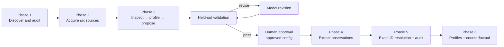
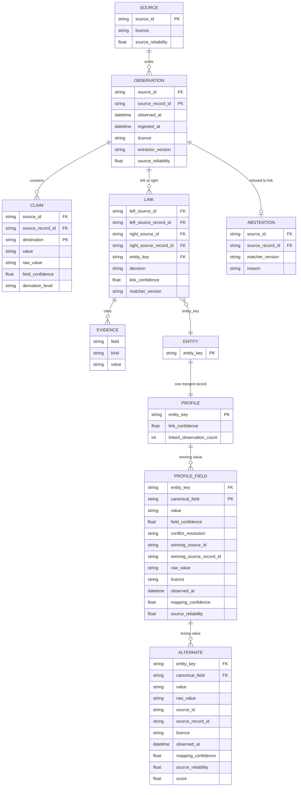

# Firmable schema inference — delivery write-up

Six public sources (ZIP/XML, ZIP/CSV, CSV, and XLSX) were mapped by one generic extractor and six agent-written configs. The run produced 6,000 held-out observations, expanded to 12,000 for resolution, 83 accepted exact-ABN links (79 entities), and 50 provenance-rich profiles.

## Delivery flow

## 1. Cost

Onboarding one source is two read-only model turns (propose, then revise). The successful ABN retry, one source, used 32,320 input tokens (19,968 cached), 812 output tokens, and 259 reasoning-output tokens. Across the six sources that were approved, onboarding used 209,209 input tokens (124,928 cached), 6,808 output tokens, and 2,555 reasoning-output tokens. A rejected first ABN attempt adds a further two turns; all seven runs together used 240,920 input tokens (138,752 cached), 8,409 output tokens, and 3,190 reasoning-output tokens.

That inference cost is one-time per source. Extraction, resolution, and profiling then run locally with no model call, so the per-record cost is USD $0.00.

Dollars: the Platform API attempt was rejected before inference for insufficient quota, so it cost USD $0.00. Codex CLI reports plan quota rather than a dollar charge, so the USD cost of the token totals above is unknown and is not estimated. Wall-clock for one source, from run-id start to the minute-resolution approval timestamp, was about 4 minutes for the successful ABN retry and about 1–4 minutes for the other five approved sources. Those times include the human approval click.

## 2. Agent design

A new source goes through six persisted stages: inspect metadata and headers, profile the 1,000-record training sample, propose a declarative mapping, extract and validate that mapping on a disjoint 1,000-record held-out sample, revise from the machine validation report, then wait for human approval. The split exists so the model proposes a config, code proves it on records the proposal did not see, and a person promotes it. Each run keeps state, prompts, the proposal, the revision, the validation report, token usage, and the approval decision under `outputs/agent_runs`.

The agent checks itself at the held-out validation step, and again with two deterministic guards: record-id fields may not be listed as unmapped, and source-record ids must be unique. A failed provider call writes `failure.json` and keeps the earlier steps, so the run resumes from the failed boundary.

A human sees the proposed-versus-revised diff, field confidence, unmapped fields, and held-out coverage, then a saved approval record. Six passing configs were approved. Normal sources used two capped turns. ABN needed one extra rejected attempt.

The weakest step is the proposal. The first ABN run returned plausible keys the contract rejected (`Unknown ontology destination: None`). That is how the weakness showed up: the validator failed the config before any record was extracted. Tightening the prompt to the literal config shape, plus a regression test, made the retry pass.

## 3. The hard one

Tenders WA resisted. The agent chose `Reference_Number` as the record id. Held-out validation then found 63 duplicate ids in 1,000 records, because one tender reference can name more than one supplier. The approved fix is the composite id `Reference_Number|Supplier_Name`, applied as a config correction with no further model call, then revalidated.

Custom code is the right call when a source cannot be turned into rows the generic extractor already understands: a format with no config operation, or a nested document the row model cannot flatten. A safety property every source must satisfy (unique record ids, legal ontology destinations, record-id columns kept out of `unmapped_fields`) belongs in the engine or the prompt, once. A source-specific id or field choice the config shape already allows stays a config correction. Tenders WA was that case. No second extractor was written.

## 4. Scale

Between 6 sources and 500, provider inference, sample acquisition and format inspection, and human-review throughput fail first. Pairwise scoring does not, because identifier blocking avoids comparing every record with every other record. The next pieces would be a durable source registry, queue and retry, sampled drift detection, source-specific validation rules, and review ordered by impact. Sources with no stable identifier would go to a separate candidate-only workflow with high-recall blocking and a much higher review threshold.

## 5. Change

A better matching model must not overwrite existing links. What has to be recorded in advance: immutable observations, mapping and extractor versions, normalisation and blocking versions, candidate features and evidence, thresholds, reviewer decisions, and link-set versions. The upgrade runs into a new link set, diffs old and new edges, sends changed high-impact entities to review, and rebuilds profiles from the approved set.

## 6. Next

With three more weeks, first an independently labelled resolution evaluation set and conservative fuzzy candidate generation. Second, incremental refreshes and source schema-drift alerts. Third, structured relationship and ownership evidence.

## Entity relationships

`destination` and `canonical_field` are ontology paths such as `entity.abn` and `address.state`. `value` is the normalised string; `raw_value` is the source text before that normalisation. `derivation_level` is `L1` in this delivery. `decision` is `accepted`. `entity_key` is `abn:<digits>`. `kind` on evidence is `exact_identifier`. Confidences and reliabilities are floats from 0 to 1. Timestamps are ISO-8601 datetimes.

Part 3 models a relationship as a pairwise accepted link with an immutable matcher version and an `entity_key` (`abn:<value>`). The key clusters links into an entity. Exact ABN agreement across different sources is the only acceptance rule in this delivery (confidence 0.99). ACN support exists and produced no additional accepted edge. Name and address similarity is not used to auto-link. Parent and subsidiary links are left out because no source provides direct ownership evidence. The held-out batch alone had too few exact overlaps for a 50-link review, so resolution also used the already-downloaded, disjoint training batches: 83 accepted links and 11,840 abstentions. A fixed-seed review of 50 links was 50 confirmed and 0 rejected, which is precision at the exact-id threshold, not a recall estimate.

Profiles choose each field independently by mapping-confidence × source-reliability, keep losing values as alternates, and store provenance (source record, raw value, licence, timestamps, and the confidence components). Deleting one source changes the sample as follows: ABR changes 46/50 profiles and 114 fields; ASIC Company 30/50 and 34; ACNC 18/50 and 30; ATO 5/50 and 5. AFS Licensee and Tenders WA change none, because no records from those sources met the linking rule.
